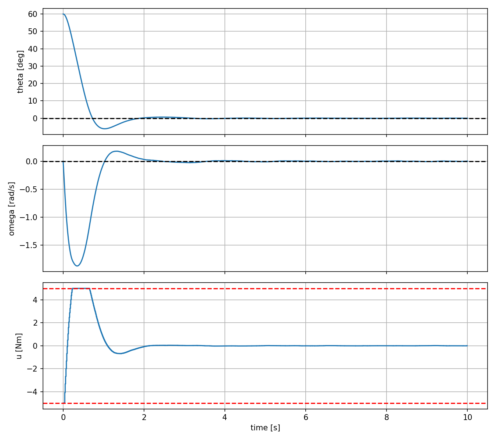
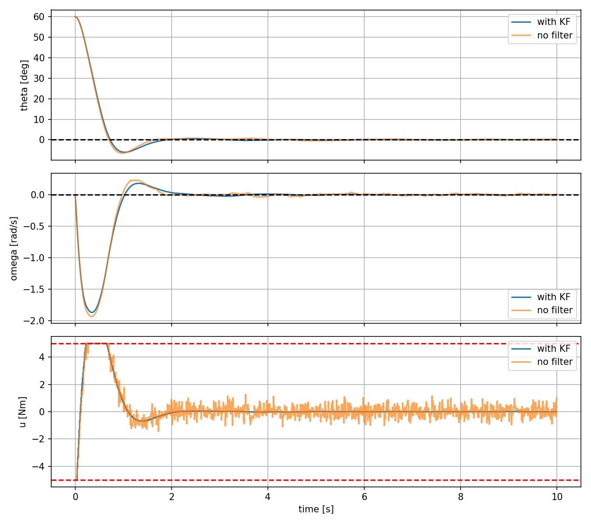

# Linear MPC for Pendulum Regulation

Linear MPC for a damped pendulum. The plant is integrated as the full nonlinear system with RK4. The controller predicts with a linearized, ZOH-discretized model and solves a constrained QP at every sampling instant, applying only the first input. A Kalman filter reconstructs the state from noisy measurements, and the closed loop is compared against the same MPC driven directly by the raw measurement.

## Model

The nonlinear pendulum dynamics are

$$
\dot{\theta} = \omega, \qquad \dot{\omega} = -\frac{g}{l}\sin\theta - \frac{b}{ml^{2}}\omega + \frac{u}{ml^{2}}
$$

The state is

$$
x =
\begin{bmatrix}
\theta \\
\omega
\end{bmatrix}
$$

where $u$ is the pivot torque and $b$ is the viscous friction coefficient.

The angle is measured from the downward equilibrium, so $\theta = 0$ is open-loop stable. This is a regulation problem, not inverted-pendulum stabilization.

With the default parameters, the continuous-time linearized open-loop poles are approximately $-0.075 \pm 3.131j$, corresponding to an oscillation frequency of roughly $0.5$ Hz and a damping envelope time constant of about $13$ s.

## Linearization

Jacobians are taken symbolically with SymPy at $(\theta, \omega, u) = (0, 0, 0)$. The continuous-time linear model is

$$
\dot{x} = A_c x + B_c u
$$

with

$$
A_c =
\begin{bmatrix}
0 & 1 \\
-\dfrac{g}{l} & -\dfrac{b}{ml^{2}}
\end{bmatrix},
\qquad
B_c =
\begin{bmatrix}
0 \\
\dfrac{1}{ml^{2}}
\end{bmatrix}
$$

The model is then discretized with a zero-order hold using `scipy.signal.cont2discrete`, giving

$$
x_{k+1} = A_d x_k + B_d u_k
$$

Both the MPC and the Kalman filter use $(A_d, B_d)$.

## Controller

At each sampling instant $k$, the MPC solves

$$
\min_{X, U} \quad \sum_{i=0}^{N-1} \left( x_{i \mid k}^{\top} Q x_{i \mid k} + u_{i \mid k}^{\top} R u_{i \mid k} \right) + x_{N \mid k}^{\top} P x_{N \mid k}
$$

subject to

$$
x_{0 \mid k} = x_k^{\mathrm{MPC}}, \qquad x_{i+1 \mid k} = A_d x_{i \mid k} + B_d u_{i \mid k}, \qquad |u_{i \mid k}| \le u_{\max}
$$

Here, $x_{i \mid k}$ denotes the state predicted $i$ steps ahead using information available at time $k$. The quantity $x_k^{\mathrm{MPC}}$ is whatever state information the controller is given at time $k$:

$$
x_k^{\mathrm{MPC}} =
\begin{cases}
\hat{x}_{k \mid k}, & \text{Kalman filter case} \\
y_k, & \text{raw-measurement case}
\end{cases}
$$

These two choices are the only difference between the two experiments reported below.

The matrix $P$ is obtained from the discrete algebraic Riccati equation, so the terminal cost $x_{N \mid k}^{\top} P x_{N \mid k}$ is the value function of the corresponding unconstrained infinite-horizon LQR problem. There is no terminal constraint or terminal invariant set, so this implementation does not provide a separate formal closed-loop stability certificate. After solving the optimization problem, only the first optimal input $u_k = u_{0 \mid k}^{\star}$ is applied to the nonlinear plant.

The QP is constructed once in CVXPY. The state $x_k^{\mathrm{MPC}}$ enters the optimization through a `cp.Parameter` representing the initial predicted state $x_{0 \mid k}$. At each sampling instant, the parameter value is updated and the same optimization problem is re-solved with OSQP using warm start.

## Defaults

| Parameter | Value |
| --- | --- |
| Mass $m$ | 1 kg |
| Length $l$ | 1 m |
| Friction $b$ | 0.15 |
| Gravity $g$ | 9.81 m/s² |
| Sampling time $\Delta t$ | 0.01 s |
| Horizon $N$ | 100 steps (1 s) |
| Torque limit $u_{\max}$ | 5 N·m |
| Simulation duration | 10 s |
| Angle measurement noise $\sigma_\theta$ | 0.05 rad |
| Rate measurement noise $\sigma_\omega$ | 0.05 rad/s |
| Disturbance torque $\sigma_w$ | 0.05 N·m |

The MPC weights are

$$
Q =
\begin{bmatrix}
20 & 0 \\
0 & 1
\end{bmatrix},
\qquad
R = 0.1
$$

The default initial condition is

$$
x_0 =
\begin{bmatrix}
60^{\circ} \\
0
\end{bmatrix}
$$

## Results

Starting from $\theta(0) = 60^{\circ}$, the closed loop reaches approximately $|\theta| < 1^{\circ}$ within about $1.5$ s, with one small undershoot. The uncontrolled pendulum remains visibly oscillatory at $10$ s. The torque limit is active during the initial part of the transient.
The main role of MPC in this example is therefore not to stabilize an unstable equilibrium, but to shape the transient while explicitly respecting the actuator constraint.



## State Estimation

The plant is simulated with two stochastic terms:

- measurement noise $v_k \sim \mathcal{N}(0, R_{kf})$ on both states
- a disturbance torque $w_k \sim \mathcal{N}(0, \sigma_w^{2})$ entering through the input channel

so the plant and sensor become

$$
x_{k+1} = f(x_k, u_k + w_k), \qquad y_k = C x_k + v_k, \qquad C = I
$$

The disturbance is drawn once per sampling interval and held constant across the RK4 stages, consistent with the zero-order-hold assumption used by the filter.

Since $\theta$ and $\omega$ are physically distinct quantities, the measurement noise covariance is

$$
R_{kf} =
\begin{bmatrix}
\sigma_\theta^{2} & 0 \\
0 & \sigma_\omega^{2}
\end{bmatrix}
$$

In the default experiment $\sigma_\theta = 0.05$ rad and $\sigma_\omega = 0.05$ rad/s. These numerical values coincide, but they are separate parameters with different units.

The disturbance is a single scalar torque entering through the input channel, so the process noise covariance follows directly from that structure:

$$
Q_{kf} = B_d \sigma_w^{2} B_d^{\top}
$$

This matrix is rank one, which correctly reflects the assumed disturbance: there is one noise source and two states. A small numerical term $\varepsilon I$ with $\varepsilon = 10^{-9}$ is added in the implementation to keep the covariance recursion well conditioned.

The filter is initialized at $\hat{x}_{0 \mid -1} = [0, 0]^{\top}$ while the true initial state is $[60^{\circ}, 0]^{\top}$, so the initial convergence transient is visible rather than hidden.

At each sampling instant the filter runs in two stages around the QP solve. The prior estimate is corrected with the measurement to give the posterior,

$$
\hat{x}_{k \mid k} = \hat{x}_{k \mid k-1} + K_k \left( y_k - C \hat{x}_{k \mid k-1} \right)
$$

The MPC then computes $u_k$ from the posterior, and the time update produces the next prior,

$$
\hat{x}_{k+1 \mid k} = A_d \hat{x}_{k \mid k} + B_d u_k
$$

The correction therefore precedes the QP solve, so the controller acts on the posterior estimate, and the prediction follows it, using the input that was actually applied.

Over the full run the estimation errors are

| Quantity | RMS error |
| --- | --- |
| $\theta$ | 0.0150 rad |
| $\omega$ | 0.0270 rad/s |

so the filter reduces the angle noise by roughly $3.3\times$ relative to $\sigma_\theta$.

## Comparison

Both runs use the same MPC, the same initial condition, and identical noise realizations (same RNG seed). The only difference is the choice of $x_k^{\mathrm{MPC}}$.

| Metric | With KF | No filter | Ratio |
| --- | --- | --- | --- |
| RMS $\theta$, full run | 0.1753 | 0.1738 | 1.0 |
| RMS $\theta$, $t > 3$ s | 0.00176 | 0.00484 | 2.7× |
| RMS $u$ | 1.282 | 1.339 | 1.04× |
| RMS $\Delta u$ | 0.0796 | 0.5689 | 7.1× |



The full-run RMS $\theta$ is essentially identical in both cases. This is expected: that metric is dominated by the $60^{\circ} \to 0$ transient, which both controllers execute the same way, so the noise contribution is buried underneath it. Reporting it alone would understate the difference.

The difference appears in two other places. Once the transient has decayed, the filtered loop regulates about $2.7\times$ more tightly. More importantly, the control increment $\Delta u$ is about $7\times$ smaller. Without the filter, the MPC interprets measurement noise on $\omega$ as real motion and responds to it, producing continuous torque chatter that is clearly visible in the bottom panel of the comparison plot. The filtered loop's input is essentially quiet after settling.

The tracking benefit is also noise-dependent. At $\sigma_\theta = \sigma_\omega = 0.01$ the chatter ratio was only about $1.7\times$; raising the sensor noise to $0.05$ is what makes the filter's contribution pronounced. With a sufficiently accurate sensor, the MPC's own feedback rejects the noise adequately on its own.

## Certainty Equivalence

Substituting $\hat{x}_{k \mid k}$ for $x_k$ in the MPC is certainty equivalence. The separation principle that justifies this holds for unconstrained LQG on a linear plant. Here the input constraint is active during the transient and the plant is nonlinear, so estimator and controller are not formally separable. The resulting output-feedback MPC works well empirically in this simulation, but the unconstrained LQG separation principle does not by itself provide a closed-loop guarantee for the constrained nonlinear system considered here.

## Limits of Validity

The prediction model is linearized about $\theta = 0$, so its accuracy degrades as the pendulum moves farther from the equilibrium.
In simulation, the closed loop may still converge from large initial angles such as $170^{\circ}$, but this is far outside the validity region of the linearization and should be interpreted as an empirical closed-loop result rather than a theoretical guarantee. Far from the origin, the predicted trajectories can be inaccurate. However, MPC applies only the first optimized input and updates the initial condition of the prediction problem at every sampling instant. Consequently, model mismatch is repeatedly corrected through feedback rather than accumulating over the entire predicted maneuver as it would under open-loop execution.

The same linearization limit applies to the Kalman filter, which propagates its estimate with $(A_d, B_d)$ while the plant is nonlinear. Estimation error therefore grows at large angles. An extended Kalman filter relinearizing at $\hat{x}_{k \mid k}$ would be the natural next step.

Parameter mismatch is not modeled: the filter and the controller both use the exact plant parameters. All results are single-realization; a Monte Carlo study over many seeds would be needed to report these numbers with confidence intervals.

## Run

```bash
pip install -r requirements.txt
python run.py
```